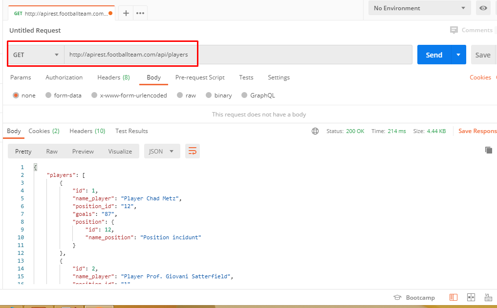
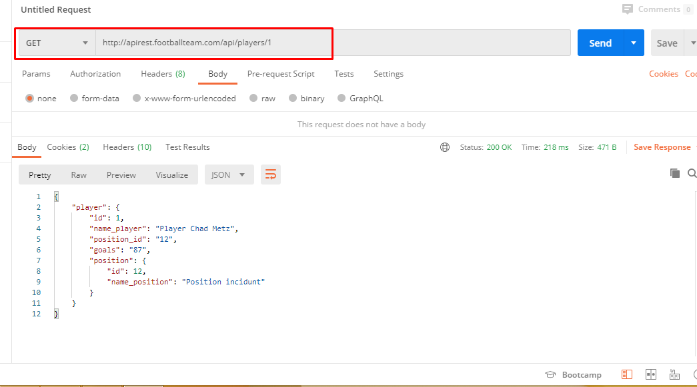
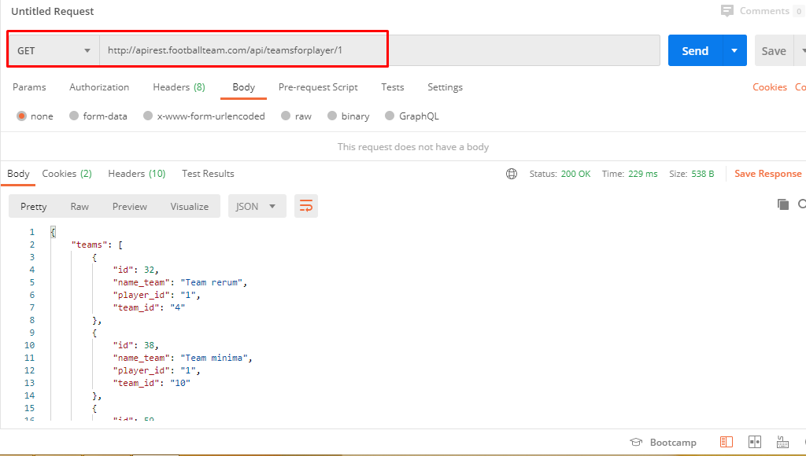
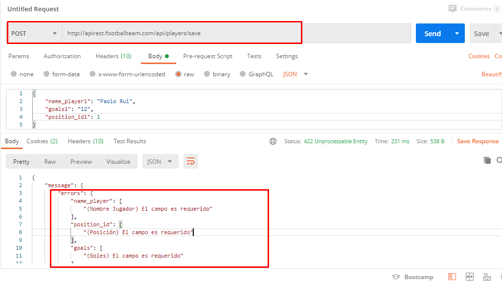
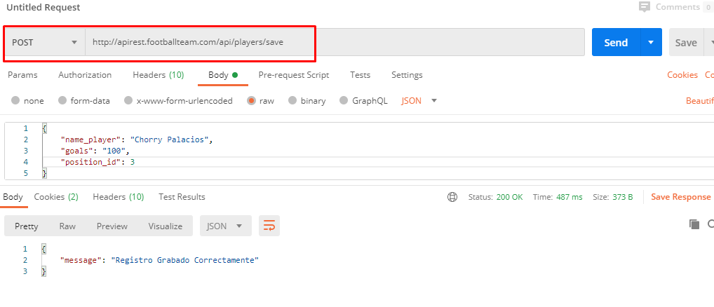

# APIREST para registro de Equipos de Fútbol con Laravel

##### Descripción:

Esta es una aplicación backend que implementa methodos para el registro de jugadores y equipos de fútbol.

##### Methodos de la aplicación:

_*Estas Respuestas son en formato JSON.*_

###### Jugadores:

-   **_GET_** => /api/players [Muestra Lista de Jugadores]
-   **_GET_** => /api/players/{player} [Muestra Información de un Jugador]
-   **_GET_** => /api/teamsforplayer/{player} [Muestra Equipos a los que pertenece un jugador].
-   **_POST_** => /api/players/save [Graba Información de un Jugador, realizando validaciones]

### Técnologia empleada

-   [Laravel]

## Pruebas realizadas con Postman

**Free Software**

[//]: #
[laravel]: https://laravel.com/docs/7.x/
